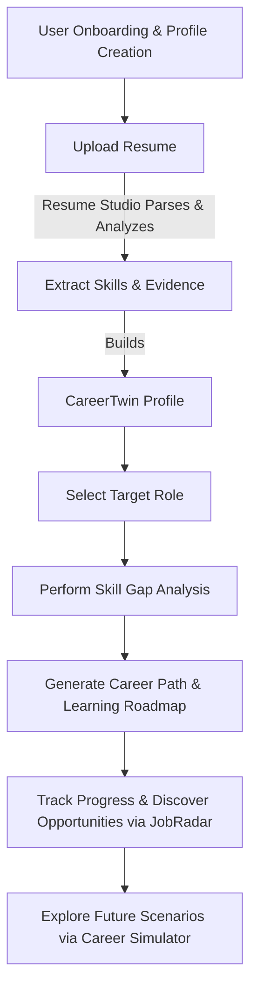

<div align="center">
  <h1>?? Pravriddhi</h1>
  <p><strong>A Full-Stack Talent, Skill & Career Intelligence Platform</strong></p>
  <br/>
  <a href="https://hiteshchugh-2006.github.io/pravriddhi/" target="_blank">
    
  </a>
  <br/><br/>
</div>

## ?? Overview

**Pravriddhi** is a comprehensive career development ecosystem that bridges the gap between your current capabilities and your future career goals. Designed for students, job seekers, and professionals, it provides actionable insights, personalized learning roadmaps, AI-driven mentorship, and an integrated Resume Studio to help you align your skills with real-world industry demands. 

## ? The Problem

In today's fast-paced job market, professionals and students face several critical challenges:
- **Skill Quantification:** Difficult to objectively assess and quantify one's own skills.
- **Blind Spots:** Lack of clarity on what specific skills are missing for target roles.
- **Overwhelming Choices:** Selecting the right career trajectory without data-driven insights.
- **Learning Paralysis:** Finding relevant, structured resources to bridge skill gaps takes too much time.
- **Opportunity Alignment:** Matching verified skills with real-world job opportunities requires intelligent data.

## ?? The Solution

Pravriddhi addresses these challenges through an integrated intelligence platform:
1. **Extract & Verify:** Parses your resume to construct a personalized **CareerTwin** profile.
2. **Analyze:** Compares your profile against real-world job market requirements to perform a deep skill gap analysis.
3. **Recommend & Roadmap:** Suggests optimal career paths and generates targeted, step-by-step learning roadmaps.
4. **Match & Guide:** Intelligently matches you with relevant job opportunities while offering continuous AI-driven mentorship and career scenario simulations.

---

## ? Key Features

- ?? **Authentication:** Secure user onboarding and login system.
- ?? **Dashboard:** Centralized hub for tracking career metrics, skill progress, and recent insights.
- ?? **CareerTwin (Career Profile):** Dynamic digital twin of your verified skills, experience, and capabilities.
- ?? **Skill Gap Analysis:** Intelligent mapping of current skills against target role requirements.
- ??? **Career Paths & Learning Roadmap:** AI-recommended trajectories and personalized learning plans.
- ?? **Resume Studio:** Interactive tool to upload, parse, analyze, and optimize resumes (includes ATS scoring & bullet improvement).
- ?? **JobRadar & Job Intelligence:** Smart job matching and market insights.
- ?? **Skill Intelligence:** Deep-dive analytics into trending skills and market demands.
- ?? **Career Simulator:** "What-If" simulator exploring how new skills or different choices impact your trajectory.
- ?? **AI Mentor:** Intelligent chat interface for personalized guidance, resume feedback, and roadmap generation.
- ?? **Workforce Intelligence:** Analytics for a broader view of talent distribution and industry trends.

---

## ??? Technology Stack

| Technology | Purpose |
|---|---|
| ?? **React (v19)** | Frontend UI Library |
| ?? **Tailwind CSS (v4)** | UI Styling and Design System |
| ? **Vite** | Build Tool and Development Server |
| ?? **Firebase** | Authentication & Database (Data persistence) |
| ?? **Google Gemini API** | Core AI & Intelligence Services |
| ?? **pdfjs-dist & mammoth**| Document Processing (Resume Parsing for PDF/Word) |
| ??? **jsPDF** | PDF Report Generation |

---

## ?? How It Works



---

## ?? Architecture & Structure

```text
Frontend (React + Tailwind)
   ?
Application / API Layer (Vite Dev Server)
   ?
Business & Intelligence Services (Document Parsing, Resume Analysis, Match Algorithms)
   ?
Database / Storage (Firebase Firestore & Storage)
   ?
External Services (Google Gemini AI API)
```
